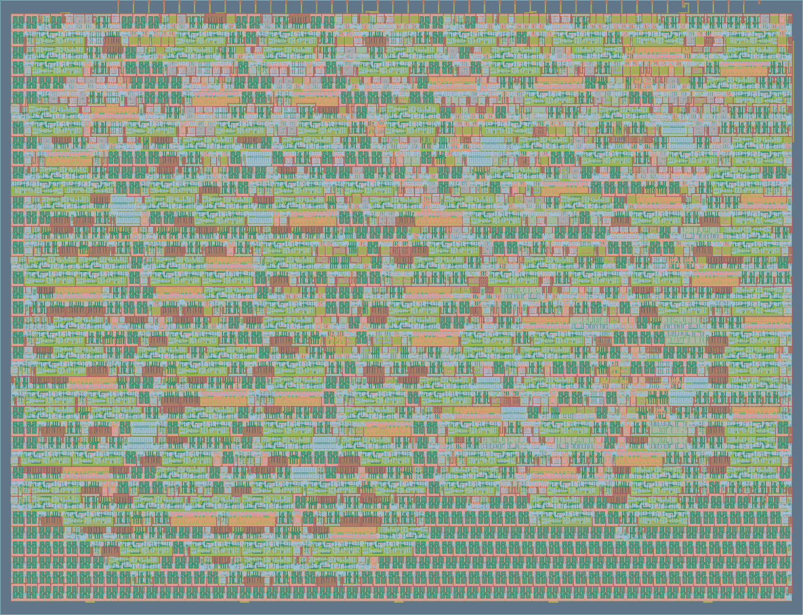

# Tiny Cache

> A 2-way set associative, write-back cache on real silicon, in 231 lines of Verilog.

<p align="center">
  
</p>
<p align="center"><sub>The hardened layout. 833 cells and 152 flip-flops in 54% of one Tiny Tapeout tile.</sub></p>

The cache sits between a caller and a main memory that lives off the chip, reached
over the pins. It holds 8 bytes in front of a 32 byte address space, and answers a
repeat request for an address it already holds in **3 clock cycles instead of 9**.
That gap is the whole point of the design, and it widens as main memory gets slower.

Built for the [Tiny Tapeout](https://tinytapeout.com) IHP26b shuttle on the
IHP `sg13g2` 130nm process.

## Contents

- [How it works](#how-it-works)
- [Pinout](#pinout)
- [Protocol](#protocol)
- [Getting started](#getting-started)
- [Test coverage](#test-coverage)
- [Results](#results)
- [Repository layout](#repository-layout)
- [License](#license)

## How it works

| | |
| --- | --- |
| Organisation | 4 sets x 2 ways, 8 lines of one byte |
| Address space | 5 bits, 32 words |
| Address split | `addr[4:0] = tag[2:0] \| index[1:0]` |
| Replacement | LRU, one bit per set |
| Write policy | Write-back, with write-validate on a miss |
| Main memory | Off chip, over the pins |
| Instrumentation | Two 5-bit saturating counters |

### Lookup

The index selects a set and the tag records which address is parked there. Both
ways of the set are compared in parallel, which is what associativity costs in
silicon: N ways means N comparators on the critical path of every access.

Each line carries a valid bit and a dirty bit. Valid says whether the line holds
anything at all, dirty says whether the cache holds the only correct copy. A
request hits only when a way is valid **and** its tag matches.

### Reads

A miss raises `MEM_REQ` with the wanted address on `MADDR` and waits. Main memory
places the word on the data bus and pulses `MEM_ACK`. However long that takes is
the miss penalty.

### Writes

Writes are not passed on to memory. A write hit updates the line and marks it
dirty, so **ten writes to one address cost a single memory access rather than
ten**. The cost is deferred to eviction: when a dirty line has to be reused, the
cache raises `MEM_WE` and writes it back first.

That writeback goes to the *evicted* line's address, not the requested one. Main
memory has no way to derive it, so the cache reconstructs it from the stored tag
and drives it out.

A write that misses does not fetch the line first. With one word per line the
write covers the line completely, so the fetched word would be discarded
immediately.

### Replacement

An empty way is filled before anything is evicted. Once both ways of a set are
occupied, one LRU bit per set picks the victim. Two addresses that map to the same
set therefore coexist; a third evicts the least recently used of them.
Associativity raises the conflict threshold rather than removing it.

## Pinout

### Inputs

| Pin | Name | Meaning |
| --- | --- | --- |
| `ui[4:0]` | `ADDR` | Address being requested |
| `ui[5]` | `START` | Hold high to request an access |
| `ui[6]` | `WE` | 0 = read, 1 = write |
| `ui[7]` | `MEM_ACK` | Memory handshake, and the counter select while idle |

### Outputs

| Pin | Name | Meaning |
| --- | --- | --- |
| `uo[7]` | `READY` | Access complete |
| `uo[6]` | `MEM_WE` | Writing an evicted line back to memory |
| `uo[5]` | `MEM_REQ` | Waiting for memory to supply a line |
| `uo[4:0]` | `MADDR` | Shared four ways, see below |

`READY`, `MEM_WE` and `MEM_REQ` are mutually exclusive, and between them they say
what the low five pins currently mean:

| When | `uo[4:0]` carries |
| --- | --- |
| `MEM_WE` | Address of the line being evicted |
| `MEM_REQ` | Address of the line being fetched |
| `READY` | bit 0 = `HIT`, bit 1 = `MISS` |
| otherwise | Hit count, or miss count if `MEM_ACK` is high |

### Data bus

`uio[7:0]` is shared by the caller and by main memory. The cache drives it only
while returning read data or writing a line back, and releases it otherwise. On a
write it never drives, because the caller is still presenting its data on those
same pins.

## Protocol

Drive an address, set `WE` for a write with the data on the bus, and hold `START`
high until `READY` appears. Then read `HIT` / `MISS`, take the word for a read, and
drop `START`.

While `START` is held, watch the two memory pins:

| Signal | What main memory should do |
| --- | --- |
| `MEM_REQ` | Put the word for `MADDR` on the bus, then pulse `MEM_ACK` |
| `MEM_WE` | Store the byte on the bus at `MADDR`, then pulse `MEM_ACK` |

Two rules that are easy to get wrong:

- **`MEM_ACK` is acted on when it rises, not while it is high.** The same pin
  selects a counter when the cache is idle, so a level would let a caller holding
  it fill a line with whatever was on the bus.
- **`READY` is held only for as long as `START` is held.** A caller that releases
  `START` early can miss it.

## Getting started

### Prerequisites

- `iverilog`
- Python **3.13 or older**, because cocotb 2.0.1 does not support anything newer

### Running the tests

```sh
python3 -m venv .venv          # must be a Python <= 3.13 interpreter
source .venv/bin/activate
pip install -r test/requirements.txt

cd test
make -B
```

```
** TESTS=23 PASS=23 FAIL=0 SKIP=0 **
```

> [!WARNING]
> `make` exits 0 even when tests fail. Read the `TESTS= PASS= FAIL=` line rather
> than the exit code. CI gates on `! grep failure results.xml` for the same reason.

### Gate level simulation

To run the same tests against the post-synthesis netlist, copy the gate level
netlist from the GDS build to `test/gate_level_netlist.v`, then:

```sh
make -B GATES=yes
```

### Waveforms

Every run writes `test/tb.fst`, dumped to unlimited depth so the cache's internals
are visible, not just its pins.

```sh
gtkwave test/tb.fst test/tb.gtkw   # or: surfer test/tb.fst
```

## Test coverage

29 cocotb tests. Main memory is modelled as an autonomous background task that
keeps no model of the cache: everything it needs arrives on the pins.

| Area | Covers |
| --- | --- |
| Read path | Cold miss, hit, line independence, tag isolation across all 32 addresses |
| Associativity | Two ways coexisting, third-address eviction, LRU ordering |
| Write path | Write hit, deferred memory update, no-fetch write miss, dirty and clean eviction, writeback addressing, one writeback per ten writes |
| Protocol | Bus ownership, edge-sensitive acknowledge, held acknowledge, zero-latency memory, reset invalidation |
| Counters | Counting and saturation |
| Workload | Hit rate under six access patterns, from tight loops to full thrash |

Two of them run **300 random reads and writes against a reference model** and then
sweep all 32 addresses, one with a fixed memory latency and one with the memory
answering after a random delay. They ignore the cache's internals and assert a
single property: a read returns the last value written to that address.

## Results

| Check | Result |
| --- | --- |
| RTL simulation | 29 / 29 |
| Gate level simulation | 29 / 29 |
| LibreLane hardening | pass |
| Tiny Tapeout precheck | pass |
| Timing signoff | No setup, hold, max cap or max slew violations, all three corners |

### Physical

| Metric | Value |
| --- | --- |
| Area | 14,568 um2 |
| Utilisation | 54.0% of a 1x1 tile |
| Cells | 833 |
| Flip-flops | 152 |
| Sequential share of area | 51% |

### Timing

| Metric | Value |
| --- | --- |
| Configured clock | 50 MHz, 20 ns period |
| Worst setup slack | 10.47 ns (slow corner, 1.08 V, 125 C) |
| Worst hold slack | 0.12 ns (fast corner, 1.32 V, -40 C) |
| Critical path | `ui_in[7]` to `uo_out[1]`, through the status and counter output mux |
| Estimated maximum | About 105 MHz on this netlist, allowing Tiny Tapeout's 8 ns of IO budget |

The critical path is not the tag comparison. It is the combinational path from the
counter select pin, through the four way multiplexer on the low output pins, to the
pins themselves. The tag compare has a whole state to settle in; that mux does not.

### Power

At 50 MHz in the slow corner, total 735 uW:

| Group | Power | Share |
| --- | --- | --- |
| Sequential | 347 uW | 47.3% |
| Clock network | 320 uW | 43.6% |
| Combinational | 67 uW | 9.1% |
| Leakage | 1.4 uW | 0.2% |

Flip-flops and the clock tree that drives them are 91% of the power, matching the
51% of area they occupy. Storage dominates both. Doubling the cache would not
double the design, but it would add roughly 104 flip-flops to the half that is
already the majority.

### Hit rate

Correctness tests say nothing about effectiveness, so `test/test_workload.py`
measures it directly:

| Access pattern | Hit rate |
| --- | --- |
| Tight loop over 4 addresses | 96.0% |
| Loop over 8 addresses, exactly capacity | 93.3% |
| 85% hot working set of 6, 15% cold | 75.0% |
| Uniform random over all 32 addresses | 25.0% |
| Three addresses in one set, alternating | 0.0% |
| Sequential scan of all 32 addresses | 0.0% |

Two of those are worth dwelling on. Uniform random lands on 25.0%, which is exactly
the fraction of memory the cache holds: with no locality to exploit, a cache is
worth only its size. And three addresses cycling through one two-way set hit
**never**, because each one evicts the one that will be needed next.

## Repository layout

| Path | Contents |
| --- | --- |
| `src/project.v` | The cache |
| `src/config.json` | LibreLane configuration |
| `test/test.py` | Correctness tests and the main memory model |
| `test/test_workload.py` | Hit rate measurement under different access patterns |
| `test/tb.v` | Simulation wrapper |
| `test/Makefile` | RTL and gate level builds |
| `info.yaml` | Submission manifest |
| `docs/info.md` | Datasheet |

> [!NOTE]
> `PROJECT_SOURCES` in `test/Makefile` and `source_files` in `info.yaml` are two
> hand-maintained lists of the same files. Adding a source file means editing both.

## License

Apache 2.0. See [LICENSE](LICENSE).
